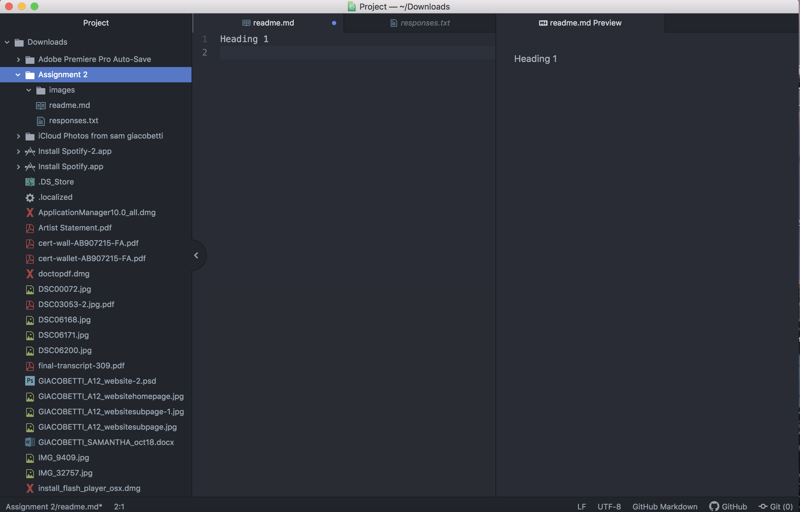

Assignment 2
Sam Giacobetti
I am going to be honest, I did not really decide to take this class, it is required for my major. That being said, I truly am excited for this class. I am a photographer and one of the main marketing aspects of being a photographer is your website. I have a website of my own, but it is created using Wix.com. I am excited to see and learn all about web design and how the "behind the scenes" action really works and develops.

1.I learned what Atom is and how to make a new project
2.I hope to learn how a website is created from the start to finish
3.I hope to create/make something cool and something I can use in my future

[Course Website](https://www.surfer.com)

[My Responses](./responses.txt)

